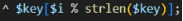

**NATAS11** by **NGUYEN PHUC DO**

- Log-in with user name : natas11 – password : `xxxxxxxxxxxxxxxxxxxxxxxxxx`

- Click ViewSourceCode 

**I/ REVIEW CODE** 

And the last is : 

<?
if($data["showpassword"] == "yes") {
`    `print "The password for natas12 is <censored> ";
}

?>

**Line 2** : variable $default\_array show password and bgcolor in the same array, It’s funny!

**Line 3 – 10** : The next is function xor encrypt with hidden key and parameter $in

**Line 14 – 27** : Function loadData with parameter $def is the code to check Cookie from user exists

This function unpack the cookie packet with this code :

$tempdata = json\_decode(xor\_encrypt(base64\_decode($\_COOKIE["data"])), true);

It means that unpack cookie data from user and return to an array when json\_decode done and assign to $tempdata

The next is check $tempdata if it has the same fields as in $default\_array in $mydata, and filter characters from input of bgcolor. Then override fields of $tempdata to $mydata, then update $mydata.

**Line 28 – 30 :** a function to setCookie for user’s http headers.

**Line 31 :** This code below is assign $defaultdata to function loadData and I explained above. 

**Line 33 – 37 :** Check request of bgcolor, filter characters from input again.

**Line 38 :** The last is assign $data to function saveData, encode it, then set it is cookie of user.

**II/ PRACTICE**

**1/ Get the cookie** 

First, when I enter natas11, I get a header data from it.

- `MGw7JCQ5OC04PT8jOSpqdmkgJ25nbCorKCEkIzlscm5oKC4qLSgubjY%3D`

%3D is ‘=’ when url decode.

Now, this lab is about XOR. I got a ciphertext, but the key is hidden,  I don’t know it.

But think ! XOR is an algorithm allow : 

- Plaintext xor key to ciphertext
- Plaintext xor ciphertext to get the key
- Ciphertext xor key to get the plaintext

So now, we don’t have the key, Just 1 way to get the key is xor both plaintext and ciphertext

I have a cookie is : `MGw7JCQ5OC04PT8jOSpqdmkgJ25nbCorKCEkIzlscm5oKC4qLSgubjY=`

And I want to change field of $defaultarray is 

- `showpassword=>no` à`showpassword=>yes`

Value of cookie created by : setcookie("data", base64\_encode(xor\_encrypt(json\_encode($d))));

**2/ XOR to get key**

- Now, decode base64(cookie)
- XOR with json)encode(default\_array)

Use PHP in VSCode 

This code is XOR 2 value ciphertext and plaintext

**Line 3 :** This is Ciphertext

**Line 16 :** Plaintext is `json\_encode($defaultdata)`

**Line 14 – 19 :** Function to XOR with Ciphertext

The result is : 

This may a ‘KNHL’ with loop because note this code : 

- It loop and returns to its original value if [i] exceed its length.

Okey I got a key is  `KNHL`

**3/ Create a new Cookie to bypass**

Now I continue use VSCode to find a new cookie.

**Line 3 :** I replace the key base64\_decode () before, change it to this key I found `KNHL`.

**Line 14 – 20 :** In line 16, Cookies are encrypted by the above encoding algorithms. I change field “showpassword”=>”yes” to server return password natas12 at **line 19**.

Ok this result is new cookie to exploit.

MGw7JCQ5OC04PT8jOSpqdmk3LT9pYmouLC0nICQ8anZpbS4qLSguKmkz

Copy it and paste in http header and send, I solved this lab!

- Thanks for reading ! 
