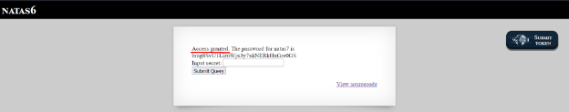
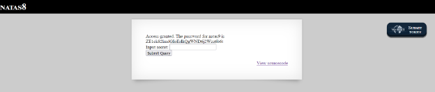

1/ Natas 0:

Hint is a joke. If we logged in next level, it’ll show password of that level. :D

Okey, first view source to check

Password is here

2/ Natas 1:

Right click was blocked, use Ctrl + U to view source

Password is here too

3/ Natas 2 :

View source again, see a path to image? Click to view

Nothing, try to access files

See users’s file. View

Password is here

4/ Natas 3 :

Again, check source

Nothing is here, try to scan directory. But a file usually have in ctf is ‘robots.txt’

Access robots.txt, see a path to dis-allow bot

Access /s3cr3t/

See a files users, password is in there

5/ Natas4 :

Hint : We can not access this page because we didn’t come from next level.

In htpp-header has a header is ‘referer’, Web server read this header can understand that this request come from where.

Use Burp-Suite, add ‘referer’ with a url of natas5.

View Response, Access was granted.

6/ Natas5 :

This page block to access because I am not logged in, but here is nothing log-in function.

Use Burp-Suite to intercept and view each request. See a field loggedin in header cookie = 0, It’s mean false, change it to ‘1’ = true and forward.

7/ Natas 6:

View source to view code.

Here is include a another file code, to check input is it equal with $secret in file code was included.

Try to access this path. See secret

Enter secret

8/ Natas7 :

View source, nothing is here but see a hint, like a path to view password.

Use function of web page, see in url taskbar, guess this web GET a input for parameter ‘page’.

Try to change this path to a path in hint.

9/ Natas 8 :

View source code, See that a webserver get a POST request to check that input equal to $encodedSecret ?

Use VSCode to decode this Secret

10/ Natas 9 :

View source code, see that get a request to call a system execute.

Use ‘;’ to explode each command

The command will like this : `grep -i a; cat /etc/natas\_webpass/natas10 ; dictionary.txt`

11/ Natas 10 :

View source, ‘ &, | , ; ‘ was block by regular expression

Try to use ‘\n’ to explode each command 

